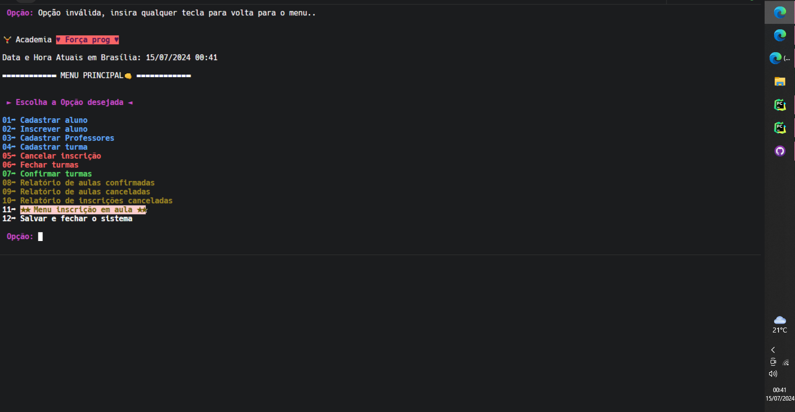
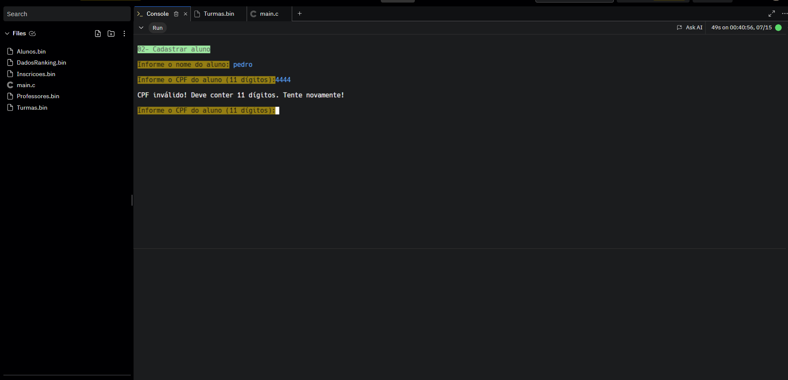
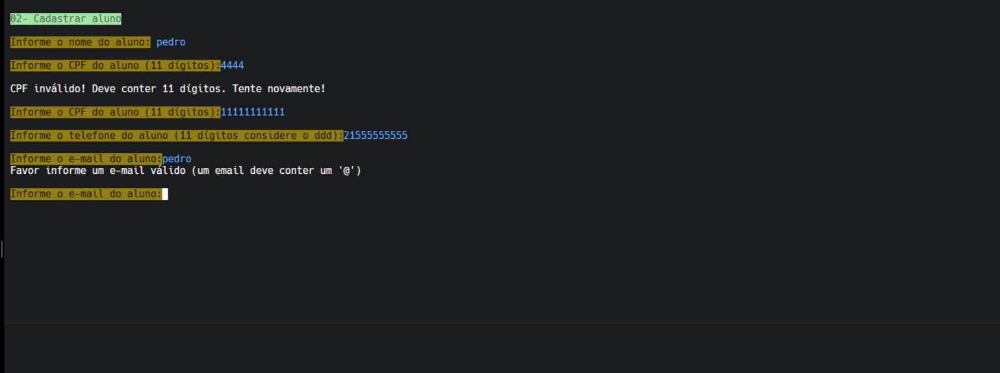
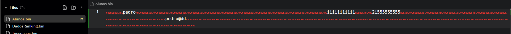

# Sistema de Gestão da Academia

## Introdução

O **Sistema de Gestão da Academia** foi desenvolvido para automatizar o controle de inscrições, turmas e dados de alunos e professores. Com esse sistema, a academia pode gerenciar suas atividades de forma eficiente, substituindo o registro manual em cadernos para mais <a href="https://raphael08.notion.site/PROG-2-Trabalho-pr-tico-Academia-2023-2-f446bd5248c0402bb307f24fd3b5e0d5?pvs=4&authuser=0"> detalhes sobre o desafio:</a>

## Estruturas de Dados

### 1. **Professores**

Armazena informações sobre os professores.

| Campo           | Descrição                           |
|-----------------|-------------------------------------|
| `idProfessor`   | Identificador único do professor    |
| `nomeProfessor` | Nome completo do professor          |
| `cpf`           | CPF do professor                    |
| `telefone`      | Telefone de contato                 |
| `email`         | E-mail do professor                 |

### 2. **Alunos**

Armazena informações sobre os alunos.

| Campo          | Descrição                           |
|----------------|-------------------------------------|
| `idAluno`      | Identificador único do aluno        |
| `nomeAluno`    | Nome completo do aluno              |
| `cpf`          | CPF do aluno                        |
| `telefone`     | Telefone de contato                 |
| `email`        | E-mail do aluno                     |

### 3. **Turmas**

Armazena as informações das turmas disponíveis.

| Campo                    | Descrição                           |
|--------------------------|-------------------------------------|
| `idTurma`               | Identificador único da turma        |
| `tipoTurma`             | Tipo da aula (Ex: Artes Marciais) |
| `diaSemanaTurma`        | Dia da semana em que a aula ocorre  |
| `horario`               | Horário da aula                     |
| `idProfessor`           | ID do professor responsável         |
| `faixaEtaria`          | Faixa etária da turma              |
| `numeroMinimoAlunos`    | Número mínimo de alunos necessários  |
| `numeroMaximoAlunos`    | Número máximo de alunos permitidos    |
| `situacaoTurma`        | Situação da turma (ativa/cancelada) |

### 4. **Inscrições**

Armazena as inscrições dos alunos nas turmas.

| Campo                  | Descrição                           |
|------------------------|-------------------------------------|
| `idInscricao`          | Identificador único da inscrição     |
| `idTurmaInscricao`     | ID da turma em que o aluno está inscrito |
| `idAlunoInscricao`     | ID do aluno inscrito                |
| `situacaoInscricao`    | Situação da inscrição (ativa/cancelada) |

### 5. **Ranking**

Armazena informações sobre a frequência dos alunos nas turmas.

| Campo             | Descrição                           |
|-------------------|-------------------------------------|
| `idRanking`       | Identificador único do ranking      |
| `idAluno`         | ID do aluno associado               |
| `frequencia`      | Número de presenças do aluno        |
| `turmaId`        | ID da turma associada               |

## exemplo


## Funcionalidades do Sistema

O sistema oferece um menu com as seguintes opções:

### 1. Cadastrar Aluno

Cadastra um novo aluno no sistema.

```c
void cadastrarAluno(struct aluno alunos[]);
```

**Entrada:** Nome, CPF, telefone e e-mail do aluno.  
**Saída:** Confirmação do cadastro ou mensagem de erro.

### 2. Cadastrar Professor

Cadastra um novo professor no sistema.

```c
void cadastrarProfessor(struct professor professores[]);
```

**Entrada:** Nome, CPF, telefone e e-mail do professor.  
**Saída:** Confirmação do cadastro ou mensagem de erro.

### 3. Cadastrar Turma

Cadastra uma nova turma de aula.

```c
void cadastrarTurma(struct turma turmas[]);
```

**Entrada:** Dia da semana, horário, ID do professor, faixa etária, número mínimo e máximo de alunos.  
**Saída:** Confirmação do cadastro ou mensagem de erro.

### 4. Inscrever Aluno

Inscreve um aluno em uma turma.

```c
void inscreverAluno(struct inscricao inscricoes[], struct aluno alunos[], struct turma turmas[]);
```

**Entrada:** ID do aluno e ID da turma.  
**Saída:** Confirmação da inscrição ou mensagem informando que a turma está lotada.

### 5. Cancelar Inscrição

Cancela a inscrição de um aluno em uma turma.

```c
void cancelarInscricao(struct inscricao inscricoes[]);
```

**Entrada:** ID do aluno e ID da turma.  
**Saída:** Confirmação do cancelamento ou mensagem de erro.

### 6. Fechar Turmas

Fecha turmas que não atingiram o número mínimo de alunos.

```c
void fecharTurmas(struct turma turmas[], struct inscricao inscricoes[]);
```

**Entrada:** Número mínimo de alunos.  
**Saída:** Confirmação do fechamento das turmas ou mensagem indicando que não há turmas a fechar.

### 7. Confirmar Turmas

Confirma turmas que atingiram o mínimo de alunos.

```c
void confirmarTurmas(struct turma turmas[], struct inscricao inscricoes[]);
```

**Saída:** Lista de turmas confirmadas.

### 8. Atualizar Ranking

Atualiza o ranking de alunos baseado na frequência.

```c
void atualizarRanking(struct ranking rankings[], struct inscricao inscricoes[]);
```

**Saída:** Atualização da frequência dos alunos e geração do ranking.

### 9. Fechar o Programa

Finaliza o programa e salva todas as informações em arquivos binários.

```c
void salvarDados(struct aluno alunos[], struct professor professores[], struct turma turmas[], struct inscricao inscricoes[], struct ranking rankings[]);
```

**Saída:** Confirmação do salvamento ou mensagem de erro.

## Relatórios

O sistema pode gerar os seguintes relatórios:

### 1. Relatório de Aulas Confirmadas

Lista todas as turmas que foram confirmadas.

```c
void relatorioTurmasConfirmadas(struct turma turmas[]);
```

### 2. Relatório de Aulas Canceladas

Lista todas as turmas que foram canceladas.

```c
void relatorioTurmasCanceladas(struct turma turmas[]);
```

### 3. Relatório de Inscrições Canceladas

Lista todas as inscrições que foram canceladas.

```c
void relatorioInscricoesCanceladas(struct inscricao inscricoes[]);
```

### 4. Relatório de Ranking

Exibe o ranking de alunos baseado na frequência.

```c
void relatorioRanking(struct ranking rankings[]);
```

## Tratamento de Erros

O sistema implementa um tratamento robusto de erros para garantir a integridade dos dados. Abaixo estão exemplos de validações e erros que podem ser tratados:

### 1. Formato de CPF

O CPF deve ser um número de 11 dígitos.

- **Exemplo inválido:** `1234567890` (10 dígitos).  
- **Mensagem de erro:** "CPF inválido. Deve conter 11 dígitos."

### 2. Formato de Telefone

O telefone deve ser um número de 11 dígitos (considerando DDD).

- **Exemplo inválido:** `123456789` (9 dígitos).  
- **Mensagem de erro:** "Telefone inválido. Deve conter 11 dígitos."

### 3. Identificadores (ID)

Os IDs (para alunos, professores e turmas) devem ser únicos e numéricos.

- **Exemplo inválido:** `0` ou `-1`.  
- **Mensagem de erro:** "ID inválido. Deve ser um número positivo e único."

### 4. Salvamento de Dados

Os dados devem ser salvos em arquivos binários corretamente. Em caso de falha de I/O, deve ser exibida uma mensagem apropriada.

- **Exemplo de falha:** Arquivo não encontrado ou sem permissão.  
- **Mensagem de erro:** "Erro de I/O. Verifique as permissões dos arquivos."

### 5. Validação de Turma e Professor

Ao cadastrar uma turma, o sistema deve verificar se o professor está cadastrado e se a turma não excede o número máximo de alunos.

- **Exemplo inválido:** `numeroMaximoAlunos = 0`.  
- **Mensagem de erro:** "Número máximo de alunos deve ser maior que 0."

### 6. Situação da Turma

Antes de inscrever um aluno, deve ser verificado se a turma está ativa.

- **Exemplo inválido:** Turma cancelada.  
- **Mensagem de erro:** "Turma não está disponível para inscrição."

### 7. Fechar Turmas

Ao fechar turmas, o sistema deve verificar quantos alunos estão inscritos e comparar com o mínimo requerido.

- **Exemplo inválido:** Turma com `numeroMinimoAlunos = 5` e apenas 3 alunos inscritos.  
- **Mensagem de erro:** "Turma abaixo do número mínimo de alunos e será fechada."

### 8. Atualização de Ranking

Ao atualizar o ranking, o sistema deve garantir que os IDs dos alunos sejam válidos.

- **Exemplo inválido:** ID de aluno não encontrado.  
- **Mensagem de erro:** "ID de aluno inválido para atualização de ranking."

## Armazenamento de Dados

Os dados são salvos em arquivos binários:

- `Alunos.bin`: Armazena os dados dos alunos.
- `Professores.bin`: Armazena os dados dos professores.
- `Turmas.bin`: Armazena

 os dados das turmas.
- `Inscricoes.bin`: Armazena os dados das inscrições.
- `DadosRanking.bin`: Armazena os dados do ranking de frequência.


## Sobre
Trabalho feito no meu término do segundo período. <br>

Desafio proposto ao término do 2º período da faculdade Unilasalle pelo professor <a href="https://www.linkedin.com/in/raphael-abreu/"> Raphael Abreu</a>, onde deveria fazer instruções detalhadas e mudanças de última hora na estrutura, concluído por <a href="https://www.linkedin.com/in/stefany-matos-b730bb253/"> Stefany </a>, <a href="https://www.linkedin.com/in/la%C3%ADze-santos/">Laize</a> e Eu.

Curiosidade
Uma condição extra era a manipulação do sistema com uma interface web. Conseguimos descobrir como realizar, mas dependia de uma hospedagem do código C para fazer, por meio de AJAX, a comunicação do JS com o C em um servidor Node. Perante a situação curta para a entrega, a ideia foi posta de lado, mas toda a estrutura está <a href="https://replit.com/@PedroCezar2/pegar-valor-com-html-js-e-c-faltou-hospedar-o-c">aqui</a> para curiosos.
##### <a href="https://replit.com/@PedroCezar2/Trabalho">projeto</a> 

## Conclusão

O **Sistema de Gestão da Academia** é uma solução abrangente que oferece funcionalidades robustas e relatórios detalhados, melhorando significativamente a operação da academia e facilitando a gestão das atividades, tente fazer uma manipulação semelhante e divulgue os resultados, qualquer coisa gere uma issues, irei ajudar em dúvidas.
